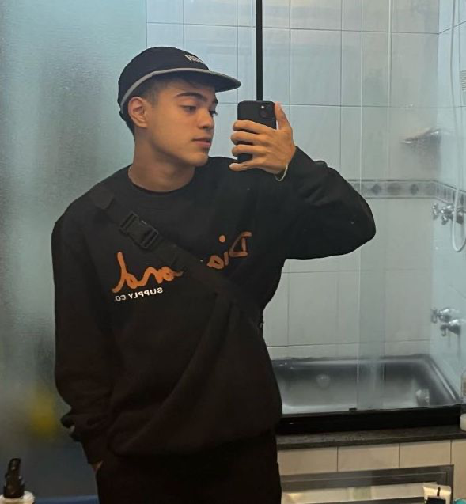

# Turma do Bem — Projeto Front-End

Site institucional desenvolvido para a ONG **Turma do Bem**, organização voltada para oferecer triagens e tratamentos odontológicos gratuitos a pessoas em situação de vulnerabilidade social.

---

## 📋 Descrição do Projeto

O site apresenta informações sobre os programas da ONG, seus públicos atendidos, estatísticas de impacto e formas de contato. A aplicação foi desenvolvida como uma SPA (Single Page Application) com React + Vite + TypeScript, garantindo navegação fluida e componentização moderna, com integração à API REST desenvolvida em Java com Quarkus e banco de dados Oracle.

---

<<<<<<< HEAD
## Vídeo de Apresentação

[Assistir no YouTube](https://youtu.be/OgqDXRQpVvU?si=xO9nD3qksmjdgsf_)

---

## Descrição do Projeto

O site apresenta informações sobre os programas da ONG, seus públicos atendidos, estatísticas de impacto e formas de contato. A aplicação foi desenvolvida como uma SPA (Single Page Application) com React + Vite + TypeScript, garantindo navegação fluida e componentização moderna.

---

## Tecnologias Utilizadas
=======
## 🚀 Tecnologias Utilizadas
>>>>>>> rm567918

- **React 19** — Interface e componentização
- **Vite** — Build e performance
- **TypeScript** — Tipagem estática obrigatória
- **Tailwind CSS** — Estilização responsiva
- **React Router DOM** — Navegação entre páginas (SPA)
- **React Hook Form** — Validação de formulários
- **Fetch API** — Consumo da API REST
- **Java + Quarkus** — Backend e API REST
- **Oracle Database** — Banco de dados

---

## 📁 Estrutura de Pastas

```
projetoturmadobem/
├── public/
│   └── favicon.svg
├── src/
│   ├── components/
│   │   ├── Header/
│   │   │   ├── Header.tsx
│   │   │   ├── LogoTDB.tsx
│   │   │   ├── MobileMenu.tsx
│   │   │   └── NavLinks.tsx
│   │   └── Footer.tsx
│   ├── pages/
│   │   ├── Home.tsx
│   │   ├── Sobre.tsx
│   │   ├── Solucao.tsx
│   │   ├── Faq.tsx
│   │   ├── Contato.tsx
│   │   ├── Integrantes.tsx
│   │   ├── IntegranteDetalhe.tsx
│   │   ├── Beneficiarios.tsx
│   │   ├── Doadores.tsx
│   │   └── listaIntegrantes.ts
│   ├── services/
│   │   └── api.ts
│   ├── App.tsx
│   ├── main.tsx
│   └── index.css
├── estilo/
│   └── img/
├── .env
├── index.html
├── package.json
├── vite.config.ts
└── README.md
```

---

## 📄 Páginas do Projeto

| Rota | Página |
|------|--------|
| `/` | Home |
| `/sobre` | Sobre o Projeto |
| `/solucao` | Solução do Projeto |
| `/faq` | Perguntas Frequentes |
| `/contato` | Contato |
| `/beneficiarios` | Beneficiários |
| `/doadores` | Doadores |
| `/integrantes` | Quem Somos |
| `/integrantes/:id` | Detalhe do Integrante |

---

## ⚙️ Como Usar

### 🔗 Links

| Recurso | URL |
|---------|-----|
| 🌐 Site na Vercel | [turmadobem.vercel.app](https://turmadobem.vercel.app) |
| 📁 Repositório GitHub | [github.com/luisrodriguesss/Projetoturmadobem](https://github.com/luisrodriguesss/Projetoturmadobem) |
| 🎥 Vídeo no YouTube | [Assistir no YouTube](https://www.youtube.com/watch?v=SEU_ID_AQUI) |

### 💻 Executar Localmente

**Pré-requisitos:** Node.js 18+ e Java 17 instalados.

```bash
# Clone o repositório
git clone https://github.com/luisrodriguesss/Projetoturmadobem

# Acesse a pasta do projeto
cd Projetoturmadobem

# Instale as dependências
npm install

# Inicie o servidor de desenvolvimento
npm run dev
```

**Para rodar a API Java:**
```bash
cd "caminho/Sprint4-Java-SorrisodoBem"
mvn quarkus:dev "-Dquarkus.enforceBuildGoal=false"
```

Acesse no navegador: [http://localhost:5173](http://localhost:5173)

---

## 👥 Integrantes

| Nome | RM | Turma | GitHub | LinkedIn |
|------|----|-------|--------|----------|
| Luis Fillipe Seripieri | 567918 | 1TDSPB | [luisrodriguesss](https://github.com/luisrodriguesss) | [Ver perfil](https://www.linkedin.com/in/luis-seripieri-1bb360395/) |
| Luiz Felipe Kichimoto | 567726 | 1TDSPB | [luizkichimoto](https://github.com/luizkichimoto) | [Ver perfil](https://www.linkedin.com/feed/) |
| Gabriel Rocha Souza | 567023 | 1TDSPB | [GabrielCreates](https://github.com/GabrielCreates) | [Ver perfil](https://www.linkedin.com/feed/) |

### Fotos

| Luis Fillipe | Luiz Kichimoto | Gabriel Rocha |
|:---:|:---:|:---:|
|  |  |  |

---

## 📬 Contato

- **Instagram:** [@ongturmadobem](https://www.instagram.com/ongturmadobem)
- **Email:** contato@turmadobem.org.br
- **Telefone:** (11) 5084-7276